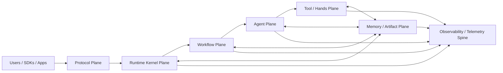
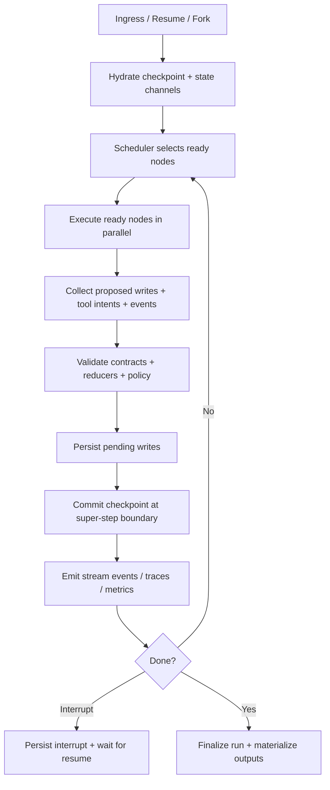
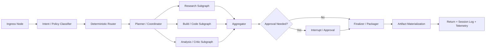
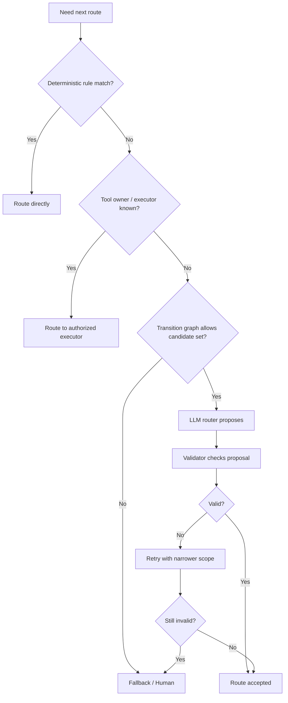

# Konductor Initial Technical Design

## Executive summary

Konductor should be built as a **multi-agent control plane**, not as a chatroom of loosely coordinated personas and not as a thin wrapper around tool-calling LLMs. The strongest lesson across the supplied framework analyses is that reliable agentic systems come from **bounded autonomy inside a typed, observable, checkpointed runtime**: LangGraph contributes the runtime-kernel model of typed state, checkpoints, interrupts, durable execution, `Command`, and `Send`; CrewAI contributes the flow-first, event-driven application layer, task contracts, replay, guardrails, and stateful flows; AG2 contributes validated routing, constrained transitions, and the principle that routing decisions should be proposed by models but checked by code; Microsoft Agent Framework contributes graph-based workflows, type safety, telemetry, DevUI, and the explicit idea that workflows are first-class orchestration artifacts; MetaGPT contributes SOP-driven roles and artifact-producing agent teams rather than free-form conversations. citeturn31search12turn31search0turn31search4turn36view1turn36view0turn36view5turn37search6turn37search0turn39view0turn4view6turn4view7

Accordingly, Konductor’s identity should be: **a typed, event-sourced, workflow-native, artifact-aware, multi-agent orchestration platform for long-running work**. It should unify structured workflows and dynamic agents instead of choosing one or the other. Workflows should handle the deterministic skeleton—state transitions, deadlines, approvals, retries, replay, and routing boundaries—while agents should operate inside those bounded states to plan, reason, critique, and use tools. LangGraph’s own distinction between workflows and agents is useful here: workflows have predetermined code paths, while agents are dynamic. Konductor should deliberately institutionalize both, with deterministic workflow governing when agentic freedom is allowed. citeturn32search2turn31search11turn37search6

The design center for Konductor is not “maximum autonomy.” It is **maximum recoverability, inspectability, and control without losing the productivity gains of agents**. That means explicit state schemas, explicit reducers, checkpoint-per-super-step, replayable events, pending-write separation, idempotent side effects, tool least privilege, injected secrets invisible to the model, approval gates for risky actions, and an operational backbone that treats retries, dead letters, timeouts, and circuit breakers as first-class runtime policy rather than afterthoughts. Durable execution, fault tolerance, and interrupt/resume semantics are already deeply validated in LangGraph’s model, while CrewAI and Microsoft’s framework both reinforce the need for observability and typed orchestration in production. citeturn31search7turn31search14turn32search0turn32search6turn36view3turn37search0turn37search6

The most important synthesis from the full set of documents is this:

**Konductor should be composed of six planes**:

1. a **Protocol Plane** for typed ingress/egress and streaming interfaces,  
2. a **Runtime Kernel Plane** for state, channels, steps, checkpoints, interrupts, and replay,  
3. a **Workflow Plane** for deterministic control graphs and stateflow,  
4. an **Agent Plane** for bounded planners, specialists, critics, and coordinators,  
5. a **Tool/Hands Plane** for typed external actions, sandboxes, approvals, and policy, and  
6. a **Memory/Artifact Plane** for session logs, semantic memory, matrices, handoffs, sidecars, and lifecycle-managed artifacts.

This is the correct abstraction boundary for “the ultimate agentic AI system” because it separates concerns that most frameworks conflate: protocol from execution, execution from orchestration, orchestration from cognition, cognition from external world mutation, and runtime continuity from long-term knowledge. Those separations are the foundation of both safety and scale. citeturn31search18turn36view1turn37search6turn37search0turn41search2

## Goals and threat model

Konductor’s primary goal is to make **long-running, high-value, multi-step, multi-agent work** behave like dependable software rather than like a lucky prompt cascade. In practice, that means five concrete outcomes. First, runs must be replayable and resumable. Second, routing and side effects must be governed by code and policy, not only by prompts. Third, artifacts—not chat logs—must become the durable source of work continuity. Fourth, the system must be inspectable in real time through traces, events, logs, and graph views. Fifth, the platform must scale from a modular-monolith deployment to partitioned, cell-like multi-tenant operation without rewriting its core contracts. LangGraph’s persistence and interrupt model, CrewAI’s replay and task contract model, and Microsoft Agent Framework’s graph-based workflows and telemetry all point in exactly this direction. citeturn31search0turn31search4turn31search17turn36view5turn36view1turn37search6turn37search0

Its non-goals are equally important. Konductor should not initially optimize for unconstrained emergent swarms, self-modifying prompt ecologies, or automatically self-evolving tool libraries in production. The supplied framework analyses repeatedly show that bounded, typed, and observable orchestration is what scales operationally; unconstrained agent chatter does not. Konductor should therefore treat dynamic teams, self-improvement, and free-form delegation as controlled features layered on top of a stable kernel, not as the kernel itself. That is consistent with LangGraph’s workflow/agent distinction, CrewAI’s Flow-first posture, and AG2’s reliance on validated speaker selection and constrained transitions. citeturn32search2turn36view1turn4view6turn4view7

The threat model must be explicit. Konductor faces at least six classes of failure.

**Model-originated failures** include hallucinated routes, invalid tool arguments, fabricated state assumptions, endless loops, over-delegation, premature finalization, and ungrounded memory writes. AG2’s validated speaker selection and LangGraph’s deterministic state machinery exist precisely because raw model choice is not trustworthy enough for orchestration. citeturn4view6turn31search12turn31search0

**Distributed-systems failures** include timeout amplification, retry storms, duplicate delivery, partial writes, event loss between database and broker, poison messages, and degraded dependencies. Circuit breakers, retries with backoff, DLQs, idempotency keys, and transactional outboxes should therefore be runtime defaults, not optional adornments. citeturn40search0turn40search2turn40search8turn41search1turn42search1turn42search3

**Security failures** include prompt injection, tool confusion, secret exfiltration, policy bypass, tenant bleed, unauthorized environment access, dangerous side effects, and replay-based duplication of mutations. LangGraph’s injected state/store annotations staying invisible to the model are especially relevant here, because they show the correct pattern: model-facing schemas and system-facing runtime context must be separated. citeturn32search0turn32search6turn37search6

**Human-process failures** include silent degradation, hidden retries, ambiguous ownership, merged artifacts without review, and irreproducible operator interventions. This is where the user-supplied Nexussy and SwarmCraft analyses are valuable: they emphasize artifacts, handoff anchors, matrix state, serial merge, and control-plane steering as means of taming long-running work.

**Operational failures** include lack of graph visibility, inability to answer “what happened?”, lack of rollback, rollout blast radius, and fleet configuration drift. This is why telemetry, immutable deployment, canarying, and graph export belong in the control plane itself rather than in a later platform backlog. Microsoft Agent Framework’s DevUI/telemetry emphasis and CrewAI’s tracing reinforce that. citeturn37search0turn36view3turn38search16

**Data-governance failures** include unbounded retention of checkpoints, PII leakage into logs or memory, unscoped semantic memory, and irreversible corruption of the execution record. LangGraph’s checkpointing and AWS’s LangGraph checkpoint guidance make it clear that persistence is powerful but dangerous without TTL, pruning, and storage discipline. citeturn31search0turn39view3

The design principle that follows is simple: **every layer in Konductor should assume the layer below it can fail, lie, duplicate, or stall**. That single assumption is what turns a framework into an operating system for agents.

## System identity and six-plane architecture

Konductor should be described internally and externally as:

> **A workflow-native control plane for agentic work, built on a deterministic runtime kernel with typed state, validated routing, bounded agents, auditable tools, and artifact-first continuity.**

That wording matters because it communicates that the architecture is the **workflow and runtime**, not the individual agents. Microsoft Agent Framework explicitly frames graph-based workflows as first-class orchestration, and LangGraph models agent applications as graphs over shared state rather than as free-floating chat participants. CrewAI’s Flows also position application logic in event-driven workflows rather than in unbounded agent conversation. citeturn37search6turn37search0turn31search12turn36view1

This six-plane decomposition is the core architectural recommendation. It aligns with the way official frameworks separate workflow, state, tools, persistence, and telemetry, while also making room for the artifact and handoff discipline emphasized in the user-supplied Nexussy and SwarmCraft analyses. LangGraph provides the sharpest evidence for a dedicated runtime kernel; CrewAI and Microsoft Agent Framework justify a distinct workflow plane; LangGraph and Microsoft together justify distinct memory/persistence and observability concerns. citeturn31search12turn31search0turn31search20turn36view1turn36view3turn37search0turn37search6

The six planes should be defined as follows:

| Plane | Primary purpose | Main responsibilities | Prevents | Trade-offs |
|---|---|---|---|---|
| Protocol Plane | Stable ingress/egress contract | APIs, SDKs, streaming, BFFs, auth, session binding, user-facing schemas | Client coupling, ad hoc integration, mixed UI/runtime concerns | Extra adapter layer |
| Runtime Kernel Plane | Deterministic execution substrate | steps, scheduling, state, channels, reducers, checkpoints, interrupts, replay | hidden state mutation, non-replayable runs, crash irrecoverability | More explicit contracts and persistence overhead |
| Workflow Plane | Deterministic orchestration | graph topology, stateflow, routing boundaries, approvals, deadlines | agent chaos, invalid transitions, spaghetti coordination | Reduced spontaneity |
| Agent Plane | Bounded reasoning and delegation | planners, specialists, critics, coordinators, evaluators | over-centralized workflow logic, brittle single-agent prompts | More components to manage |
| Tool / Hands Plane | World interaction under policy | typed tools, wrappers, DI, sandboxes, approvals, policy, audit | unsafe side effects, secret leakage, arbitrary environment access | More ceremony before tools run |
| Memory / Artifact Plane | Continuity and durable outputs | session log, semantic memory, matrix, artifacts, handoffs, sidecars | context loss, prompt stuffing, untraceable work products | More storage systems and lifecycle rules |

The central rationale is that each plane owns a distinct failure boundary. If protocol logic is mixed with runtime, UI needs contaminate core execution. If workflow is mixed with agents, routing becomes prompt-dependent. If tools are mixed with agent state, secrets and side effects leak. If persistence is mixed with prompt context, replay and governance become impossible. Those are precisely the pathologies the referenced systems worked to avoid. citeturn32search2turn31search0turn32search0turn37search6

The biggest trade-off is complexity. Konductor is intentionally more structured than lightweight agent wrappers. But that complexity is **front-loaded operational discipline**. It replaces the much more expensive complexity of debugging non-deterministic, long-running, side-effecting agent failures after they reach users.

## Core primitives and contracts

Konductor should not define architecture in terms of “agents talking.” It should define architecture in terms of **runtime primitives**. This is one of the clearest lessons from LangGraph, whose official model centers on state, nodes, edges, commands, interrupts, and checkpoints, and from CrewAI, whose production abstractions center on flows, tasks, and replayable outputs rather than on ambient conversation. citeturn31search12turn31search2turn31search4turn36view0turn36view5

### Primitive set

| Primitive | Purpose | Required fields | Key invariant |
|---|---|---|---|
| **Run** | One execution instance of a workflow or workflow-agent | `run_id`, `thread_id`, `tenant_id`, `workflow_id`, `entrypoint`, `status`, `deadline`, `budgets`, `parent_run_id?` | A run is replayable from checkpoints and fully correlated in telemetry |
| **Workflow** | Versioned orchestration definition | `workflow_id`, `version`, `state_schema`, `nodes`, `edges`, `routing_policy`, `approval_policy`, `tool_policy` | Workflow topology is immutable per version |
| **Node** | Executable unit in the graph | `node_id`, `kind`, `input_contract`, `output_contract`, `allowed_writes`, `timeout_budget`, `retry_policy`, `tool_scope` | Nodes read snapshots and emit writes; they do not mutate shared state directly |
| **StateSchema** | Typed state contract for a workflow | named fields with type, reducer, persistence class, sensitivity class, visibility | State is raw structured data, not preformatted prompt text |
| **Channel** | Merge and persistence policy for a field | `name`, `value_type`, `reducer`, `writer_mode`, `durability`, `visibility` | Single-writer by default; multi-writer requires explicit reducer |
| **Command** | Data-encoded control action | `update`, `goto`, `resume`, `spawn`, `emit` | Control flow is represented as validated data, not hidden side effects |
| **Send** | Dynamic fan-out work item | `target`, `args`, `correlation_id`, `parent_checkpoint_id` | Spawned work executes on a later tick against committed state |
| **Checkpoint** | Snapshotted execution boundary | `checkpoint_id`, `parent_checkpoint_id`, `thread_id`, `superstep`, `state_hash`, `updated_channels`, `pending_writes_ref` | Checkpoints represent stable, replayable boundaries |
| **EventEnvelope** | Universal telemetry and event-bus record | `event_id`, `sequence`, `run_id`, `checkpoint_id`, `type`, `timestamp`, `source`, `payload`, `trace_id` | Every meaningful action emits one |
| **ArtifactRef** | Reference to generated or imported work product | `artifact_id`, `kind`, `uri`, `sha256`, `lifecycle_state`, `sidecar_ref`, `owner`, `tenant_scope` | Artifacts are passed by reference, not copied into prompts |
| **ToolCall** | Auditable request for side effects or retrieval | `call_id`, `tool_name`, `args_hash`, `risk_class`, `approval_id?`, `sandbox_id?`, `status`, `result_ref?` | Every external action is attributable, policy-checked, and replay-aware |
| **Approval** | Human or policy decision point | `approval_id`, `target_ref`, `risk_class`, `requested_by`, `status`, `approver`, `rationale`, `expiry` | Irreversible or high-risk actions cannot bypass it |

These contracts should be versioned and language-neutral. Konductor’s SDKs can be ergonomic, but the control plane itself must think in these primitives. That design follows directly from LangGraph’s typed state and command model, Microsoft Agent Framework’s type-safe workflow posture, and CrewAI’s guarded task contracts and replay surfaces. citeturn31search12turn31search2turn37search6turn36view0turn36view5

### Runtime execution model

Konductor’s kernel should use a **Pregel-like super-step loop**. This is the single most important runtime decision in the document.

LangGraph documents that a graph with a checkpointer persists checkpoints at each **super-step boundary**, tied to a `thread_id`, and that interrupts pause execution until resumed with new input. It also documents that time-traveling creates a fork rather than rolling back original history. Those three behaviors—super-step checkpoints, interrupt/resume, and branch-preserving replay—should be copied almost exactly into Konductor’s runtime kernel. citeturn31search0turn31search4turn31search17

### Node contract

Each node should obey four rules.

A node reads an **immutable snapshot** of state.  
A node returns **writes**, not mutations.  
A node may request side effects only through the **Tool/Hands Plane**.  
A node’s output must validate against its declared contract before merge or checkpoint.

That directly follows both LangGraph’s graph model and its guidance to keep state as raw data rather than prompt-formatted text. citeturn31search12turn31search9

### Writes, reducers, and channel policy

Konductor should adopt the following defaults:

- **single-writer by default** for scalar channels,  
- **explicit reducer required** for shared accumulators,  
- **explicit overwrite mode** for destructive replacement,  
- **visibility class** per channel (`model-visible`, `runtime-only`, `secret`, `audit-only`),  
- **durability class** per channel (`checkpointed`, `ephemeral`, `externalized`).

This is the cleanest way to prevent silent races, hidden overwrites, and accidental model exposure of system internals. LangGraph’s explicit state/update model and injected-state separation support this direction strongly. citeturn31search12turn32search0turn32search6

### Pending writes and side-effect safety

Konductor should keep **pending writes** separate from stable checkpoints. This is essential when a node has completed execution and produced outputs, but the system has not yet committed the next stable super-step. Pending writes give the runtime a place to recover from process crashes without either losing work or lying about what was successfully committed. That separation is a cornerstone of durable orchestration. LangGraph’s persistence model and fault-tolerance guidance strongly support this type of replay discipline. citeturn31search0turn31search7turn31search14

Side effects must also be replay-safe. The correct rule is:

> **Pure computation can replay; side effects must be idempotent or checkpoint-bound.**

LangGraph’s durable execution guidance explicitly warns that resumed workflows replay from an earlier safe point and therefore advises wrapping non-deterministic or side-effecting operations inside durable task boundaries. Konductor should generalize that rule globally. citeturn31search7

### Interrupts, resume, and forking

Konductor should use **checkpoint-plus-replay**, not suspended call stacks, for human-in-the-loop. An approval request, clarification request, or governance stop should persist the run state, create an interrupt record, and halt. Resume should be expressed as a scoped `Command` or `Approval` resolution targeted at the saved interrupt, not as ambient chat continuation. This is more portable, easier to audit, and much less fragile than serialized stack resumption. LangGraph’s interrupt model is already aligned with this. citeturn31search4turn31search17

Forking should be a first-class feature. Updating state at a prior checkpoint should create a new branch rather than overwrite the old one. This preserves execution lineage and makes replay a debugging and experimentation tool instead of a history-destroying mechanism. citeturn31search17

## Workflow, routing, and handoff architecture

Konductor’s workflow layer should combine three ideas:

- **Flow-first orchestration** from CrewAI,  
- **validated routing ladders** from AG2, and  
- **graph-native branching and dynamic sends** from LangGraph. citeturn36view1turn4view6turn4view7turn31search11turn30view2

### Workflow model

A workflow in Konductor should be a versioned graph with:

- an entrypoint,
- a typed `StateSchema`,
- named nodes,
- explicit edges,
- optional conditional edges,
- explicit transition constraints,
- declared approval points,
- budget and deadline policies,
- artifact and memory policies,
- and a final packager/finalizer.

The important design choice is that **the workflow owns global control**. Agents do not. This matches the Flow-first posture in CrewAI and the graph-first posture in LangGraph and Microsoft Agent Framework. citeturn36view1turn31search12turn37search6turn37search0

### Recommended execution skeleton

This pattern keeps the high-variance agentic work in the middle of the graph while reserving the entrance, routing, approvals, and final packaging for deterministic nodes. That gives Konductor the best of both worlds: flexible specialist reasoning without surrendering the overall execution contract. LangGraph’s workflow guidance and Microsoft Agent Framework’s graph-based workflow emphasis both support this layering. citeturn32search2turn31search12turn37search0turn37search6

### Routing and handoff ladder

Konductor should not let any single LLM routing output directly control the next hop in critical workflows. The routing ladder should be:

1. **deterministic policy rules**,  
2. **tool ownership / executor eligibility**,  
3. **transition-graph legality checks**,  
4. **LLM router proposal**,  
5. **validator review**,  
6. **retry with narrowed candidate set**,  
7. **safe fallback route**,  
8. **human escalation if still unresolved**.

That ladder is heavily inspired by AG2’s speaker-selection and constrained group-chat model, where automatic selection is validated and valid transitions can be explicitly constrained. CrewAI’s structured outcomes for reliable routing are also relevant here. citeturn4view6turn4view7turn36view2

The rationale is straightforward. Deterministic state and policy know many things the model should not guess: current workflow state, tenant restrictions, available tools, approval status, deadlines, environmental outages, and dependency health. The model is best used as a **proposal engine for ambiguous semantic classification**, not as the final authority over execution control.

This design prevents at least five expensive failure modes: routing loops, impossible handoffs, unauthorized tool execution, route drift under prompt variation, and non-replayable branching logic. The trade-off is that agentic spontaneity is reduced. For Konductor, that is a good trade, especially in production.

### Stateflow and transition graphs

Konductor should support both **hard workflows** and **soft workflows**.

Hard workflows are used for production paths, regulated paths, CI/CD, code modification, and external actions. They rely on explicit states and transition graphs.

Soft workflows are used for exploration, brainstorming, open-ended research, and pre-commit reasoning. They allow more LLM-proposed branching but still inside bounded transitions.

This mirrors the distinction between workflows and agents in LangGraph and the practical difference between deterministic Flows and more autonomous Crews in CrewAI. citeturn32search2turn36view1

### Agent model

Konductor should support several agent roles, but all under the workflow’s governance:

- **Coordinator**: decomposes the task and owns the working plan,
- **Specialists**: research, code, analysis, retrieval, domain-specific synthesis,
- **Critic / Evaluator**: checks outputs against contracts, evidence, and policy,
- **Packager**: deterministic final assembler,
- **Human Proxy**: approval and judgment interface,
- **Observer Agents**: optional evaluators that never directly mutate state.

The key rule is that agents are **nodes or subgraphs**, not the architecture itself. Microsoft Agent Framework’s graph-based workflows, LangGraph’s node/state model, and MetaGPT’s role-based SOP perspective all point the same way. citeturn37search0turn31search12turn39view0

## Tool, memory, artifact, and security architecture

### Tool model and security boundary

Konductor’s tools should be treated as **governed external actions**, not as convenience functions.

Every tool must have:

- a typed input schema,
- a typed output schema or explicit artifact result,
- a declared risk class,
- a permission scope,
- a timeout budget,
- idempotency requirements,
- audit behavior,
- and an execution environment class.

LangGraph’s injected-state pattern shows why runtime context and model-visible schemas must be separated. Tools may need access to state, persistent stores, secrets, or tenant metadata, but that information must stay invisible to the model-facing tool signature. citeturn32search0turn32search6

Konductor should expose tools internally through a rich typed registry, but at the outer model boundary it should prefer a **single controlled execution wrapper** pattern for risky environments:

`execute(name, input_json)`

This is the right compromise. It preserves model simplicity and security at the boundary while keeping internal typing and validation rich. The user-supplied Microsoft Agent Framework sample analysis strongly supports this direction via its “brain/hands/session” model and generic execute wrapper, even though this particular mechanism was reported from the sample analysis rather than from the concise official overview.

### Tool exposure options

| Option | Description | Strengths | Weaknesses | Recommendation |
|---|---|---|---|---|
| Direct tool exposure | Every tool appears separately to the model | Rich semantics; easier native tool selection | Large attack surface; harder policy; schema sprawl | Good only for low-risk, low-count internal tools |
| Single `execute(name,input_json)` wrapper | Model sees one external-action contract | Small boundary; easier policy, audit, sandboxing | Loses some semantic richness unless descriptions are excellent | Best default for risky or multi-tool environments |
| Hybrid model | Low-risk typed tools exposed directly; high-risk tools routed via `execute` | Balances usability and safety | More boundary complexity | **Recommended for Konductor** |

Konductor should assign at least four risk classes:

- **R0** read-only / retrieval,
- **R1** internal reversible mutation,
- **R2** external reversible side effects,
- **R3** irreversible or high-impact side effects.

R2 and R3 must pass through approval gates unless overridden by trusted policy. Read-only tools usually do not need human approval, but still need audit, quotas, and circuit breakers.

### Sandboxing, secrets, and DI

The Tool/Hands Plane should never run directly in the same trust context as the reasoning layer if the tool can mutate files, shell, browser, cloud resources, or third-party systems.

Konductor should therefore support:

- **ephemeral sandboxes** for risky calls,
- **worktree-isolated code workers** for repository mutation,
- **brokered credentials** resolved at runtime,
- **secret handles** rather than raw secret values,
- and **dependency injection** of runtime state, stores, and authorization.

The critical security rule is:

> **Injected runtime context is merged after model-provided args and wins on collision.**

That is exactly the spirit of LangGraph’s injected state/store model. citeturn32search0turn32search6

### Memory architecture

Konductor should use **multiple memory stores with distinct purpose**, not “one memory.”

| Store | Purpose | Durability | Query mode | Recommended use |
|---|---|---|---|---|
| **Checkpoint store** | Execution continuity | High | by `thread_id`, checkpoint lineage | super-step state, replay, interrupts |
| **Session log** | Append-only runtime truth | High | sequential event read | what happened during the run |
| **Matrix / run projection** | Current operational projection | Medium | point lookups | active tasks, stage status, artifact lifecycle |
| **Semantic memory** | Cross-run recall | High | semantic + scoped retrieval | preferences, facts, reusable decisions |
| **Experience pool** | Reuse successful trajectories/artifacts | Medium/High | similarity + success score | repetitive tasks, proven templates |
| **Artifact store** | Durable work products | High | by ref/version/lifecycle | docs, code bundles, reports, plans |

This separation is strongly supported by the official frameworks. LangGraph separates checkpoint persistence from memory/store concerns and explicitly supports short-term thread persistence plus long-term memory; CrewAI’s memory model uses semantic similarity, recency, and importance; event-sourcing literature supports the use of append-only logs as the durable history; user-supplied SwarmCraft and Nexussy analyses reinforce the need for a current-state projection or “matrix” distinct from the append-only history. citeturn31search0turn31search1turn36view4turn41search2

Konductor should also make a hard distinction between **aggregation** and **compaction**:

- **aggregation** turns runtime events and artifacts into durable knowledge,
- **compaction** reduces the active context window while preserving enough continuity to continue the run.

Those are not the same operation. This is one of the strongest ideas from the AG2 analysis supplied by the user, and it should survive intact into Konductor.

### Artifact-first continuity

Konductor should treat artifacts as first-class outputs and inputs. That means every meaningful generated object—plan, report, code patch, merge report, review output, approval record, evaluation report—should be stored as an artifact with sidecar metadata. The sidecar should carry machine-usable fields such as version, owner, dependencies, lifecycle state, acceptance criteria, approvals, provenance, and sensitivity. This mirrors the artifact-first lessons in the user-supplied Nexussy and SwarmCraft analyses and is also consistent with MetaGPT’s emphasis on output artifacts rather than just conversation. citeturn39view0

Artifacts should follow an explicit lifecycle:

`draft -> review_ready -> revision_required -> approved -> locked -> superseded`

Locked artifacts should be immutable by default. New work should create new versions or child artifacts, not mutate approved truth in place.

For large artifacts, Konductor should use **claim-check behavior**: pass `ArtifactRef`s and summaries through workflows, not full payloads. This prevents prompt bloat, keeps context windows sane, and makes replay/versioning much easier. Azure’s architecture pattern catalog explicitly includes Claim Check as a reliability pattern for avoiding oversized messages. citeturn40search4

## Observability, operations, delivery, scale, and product surfaces

### Observability and telemetry

Konductor’s observability model should be **event-first and trace-native**.

Every run must emit:

- structured events,
- distributed traces,
- structured logs,
- metrics,
- graph snapshots,
- checkpoint lineage,
- tool audit records,
- and final artifact manifests.

OpenTelemetry is the natural base because it standardizes traces, metrics, and logs, and both CrewAI and Microsoft Agent Framework emphasize built-in tracing/telemetry. LangGraph also supports streaming runtime updates. citeturn38search16turn36view3turn37search0turn31search20

The DevUI should be a first-class control surface, not a future debugging convenience. It should show:

- active workflows and graph topology,
- node-level execution state,
- latest checkpoint and branch tree,
- event stream,
- agent outputs,
- tool calls and approvals,
- artifacts and lifecycle,
- memory recalls and writes,
- cost/latency/token budgets,
- and replay / fork actions.

Microsoft Agent Framework’s public overview and repo both explicitly foreground graph-based workflows and DevUI, supporting the idea that inspectability is part of the product, not just operational plumbing. citeturn37search0turn37search6

### Operational patterns

Konductor should ship with the following operational patterns as **built-in runtime policy**, not as optional examples:

**Transactional outbox.** Any state mutation that must emit downstream events should write business state and outbox records atomically, then relay asynchronously. This is the standard answer to dual-write failures. citeturn41search1

**Dead-letter queues.** Poison events, failed tool compensations, or malformed replay payloads must be quarantined rather than retried forever. Amazon SQS’s DLQ model captures the essential behavior: isolate repeatedly unprocessed messages for debugging and reprocessing. citeturn42search3

**Idempotency.** Any externally visible mutation or retriable internal command must support idempotency keys. Stripe’s API guidance is the clearest articulation: idempotency keys let clients safely retry without accidentally performing the same operation twice. citeturn42search1

**Circuit breakers and bounded retries.** Konductor must assume remote dependencies can fail for extended periods. Circuit breakers stop repeated futile calls; retries handle transient faults; retry storms must be actively prevented with bounded attempts, exponential backoff, and jitter. Azure’s guidance explicitly warns that careless retries can become an internal DoS vector. citeturn40search0turn40search2turn40search8turn40search14turn40search16

**Timeout budgets and deadlines.** Each run and each node should propagate a remaining deadline, not independent arbitrary timeouts. This prevents ghost work after the caller has already lost interest and makes budget exhaustion visible in the trace. While this document treats deadline propagation as a design recommendation, it is closely aligned with the disciplined workflow model required by checkpointed orchestration.

**Readiness and liveness.** Konductor services should separate “alive” from “ready.” Kubernetes explicitly distinguishes liveness and readiness probes; this is the right model for agentic platforms too, because dependency degradation should usually drain traffic rather than restart the whole control plane. citeturn40search3turn40search7

### Worker and CI patterns

For software-delivery and repository-modifying workflows, Konductor should adopt the excellent operational lessons from the user-supplied Nexussy analysis:

- worktree-isolated workers,
- parallel worker execution,
- serial merge,
- explicit conflict reports,
- handoff artifacts between stages,
- and stage-gated review before irreversible changes.

This is the right bridge between generic agent orchestration and practical engineering automation. It prevents cross-worker collisions, reduces context pollution, and makes code-generating agents behave more like disciplined CI workers than like shared-shell chatbots.

### Deployment strategies

| Strategy | Strength | Weakness | Konductor use |
|---|---|---|---|
| Rolling update | Simple | Harder rollback; mixed fleet behavior | fine for low-risk internal services |
| Blue-green | Fast rollback, clean switch | Double capacity during cutover | good for stable control-plane services |
| Canary | Small blast radius, metric-guided rollout | More routing/telemetry complexity | **recommended for runtime kernel and Tool/Hands services** |

In practice, Konductor should use **immutable infrastructure**, canary releases for high-risk runtime components, and blue-green for simpler API/DevUI surfaces. The choice depends on blast radius and ability to compare old/new behavior through telemetry. Microsoft and CrewAI’s telemetry emphasis makes canary analysis much more viable. citeturn36view3turn37search0turn38search16

### Scalability and multi-tenancy

Konductor should begin as a **modular monolith with hard module boundaries**, then partition deliberately.

The initial deployment should be a modular monolith because the hardest problems are not compute scale but correctness of contracts, runtime semantics, replay, artifacts, and tooling. Splitting too early would distribute immature abstractions. This recommendation also matches the spirit of the supplied Senior Architect patterns: strong boundaries first, physical distribution later.

A credible scaling path is:

- **Phase 1:** modular monolith,
- **Phase 2:** logical multi-tenancy with tenant-scoped stores and queues,
- **Phase 3:** shard checkpoint/event stores and artifact stores,
- **Phase 4:** cell-based deployment for large or isolated tenants,
- **Phase 5:** dedicated specialized cells for high-risk Tool/Hands workloads.

LangGraph’s thread-oriented persistence and AWS’s guidance on checkpoint TTL/offloading make it clear that checkpoint storage and log growth need deliberate scaling and lifecycle planning. citeturn31search0turn39view3

### UX, DevUI, SDK, and protocol surfaces

Konductor should expose four product surfaces:

- **SDK/API surface** for programmatic execution,
- **streaming protocol surface** for incremental events and state updates,
- **DevUI / operator console** for graph inspection, replay, approvals, and artifact browsing,
- **workflow-as-agent surface** so a whole workflow can present as a callable “agent” to another workflow or application boundary.

The official frameworks strongly support streaming and graph execution surfaces; workflow-as-agent is a highly valuable compositional pattern reported in the user-supplied Microsoft Agent Framework sample analysis and should be preserved in Konductor because it hides internal complexity behind a stable contract. citeturn31search20turn37search0turn37search6

A thin BFF layer is also advisable. The frontend should not consume internal runtime objects directly. A BFF can tailor graph, event, artifact, and approval views for web, CLI, or chat surfaces without contaminating the runtime kernel.

## MVP, phased roadmap, open questions, and attribution

### MVP vertical slice

The MVP should not attempt to prove every idea in this document. It should prove the **architecture**.

A good first vertical slice is:

**User request -> deterministic intake -> planner/coordinator -> parallel research/build specialists -> critic/evaluator -> approval interrupt -> final packager -> artifact store -> replayable event log**

That slice should include:

- one versioned workflow,
- typed state schema and channels,
- step-based scheduler,
- checkpoints and thread IDs,
- interrupt/resume,
- one semantic memory store,
- one artifact store with sidecars,
- one safe tool wrapper,
- one risky tool with approval,
- event stream + trace + DevUI,
- replay and fork,
- and outbox-backed downstream event publication.

If Konductor can do that well, the rest is extension.

### Phased roadmap

**Phase Alpha — Kernel Integrity**  
Deliver: state schema, channels, node contract, super-step loop, checkpoints, interrupts, replay, forking, event envelopes, trace IDs.  
Success criterion: one workflow can pause, resume, replay, and fork deterministically.

**Phase Beta — Workflow and Routing**  
Deliver: transition graphs, router ladder, validator, fallback logic, `Command`, `Send`, critic node, deterministic finalizer.  
Success criterion: workflow survives invalid routing proposals and never executes illegal transitions.

**Phase Gamma — Tools and Security**  
Deliver: tool registry, `execute(name,input_json)`, DI, risk classes, approvals, sandbox adapter, audit trail, idempotency keys.  
Success criterion: risky tools are impossible to run without proper policy and every call is attributable.

**Phase Delta — Memory and Artifacts**  
Deliver: session log, matrix projection, semantic memory with provenance, artifact lifecycle, sidecars, claim-check references, experience pool skeleton.  
Success criterion: long-running work can continue across sessions without relying on giant prompts.

**Phase Epsilon — Operations and Delivery**  
Deliver: outbox relay, DLQ handling, circuit breakers, backoff policy, readiness/liveness, canary deployment support, immutable packaging.  
Success criterion: failures degrade safely and can be diagnosed through telemetry.

**Phase Zeta — Scale and Productization**  
Deliver: multi-tenant isolation, sharded stores, cell routing for large tenants, workflow-as-agent composition, BFFs, richer DevUI.  
Success criterion: multiple tenants and workflows operate without cross-contamination or operational collapse.

### Open questions and decisions to settle early

The following questions matter enough that leadership should decide them early:

**How much determinism is enough?**  
Konductor’s value depends on replay and auditability. That pushes hard toward deterministic workflows and side-effect isolation. The trade-off is lower spontaneity.

**What is the first trust boundary?**  
Will risky tools run in fresh sandboxes from day one, or is there an interim shared worker model? The answer changes the threat model more than almost any other decision.

**What is the persistence source of truth?**  
Should the event log or checkpoints be considered primary for debugging and lineage? The design here recommends session log for history, checkpoints for continuity, and matrix for current projection.

**What memory writes are allowed automatically?**  
Konductor should not let every agent write durable memory by default. Durable memory needs provenance, scope, sensitivity, and confidence.

**What counts as an artifact?**  
If artifact boundaries are too loose, everything becomes noise. If too strict, continuity suffers. This needs a product decision as much as a technical one.

**When do we split the monolith?**  
A modular monolith should be the starting point, but leadership should predefine the extraction triggers: tenant count, event volume, tool risk, storage growth, or organizational ownership.

### Attribution and credits

This design synthesizes ideas from the following sources.

**Official/public framework sources used directly in research**

- **AG2** — for validated speaker selection, constrained transitions, and the principle that routing should be proposed by the model but checked by code. citeturn4view6turn4view7
- **CrewAI** — for Flow-first orchestration, event-driven flows, task guardrails, human feedback loops with structured outcomes, memory scoring by semantic similarity/recency/importance, replay from task outputs, and built-in tracing. citeturn36view1turn36view0turn36view2turn36view4turn36view5turn36view3
- **LangGraph** — for typed shared state, graph-native agents/workflows, `Command`, `Send`, super-step checkpoints, thread-based persistence, interrupts, durable execution, time-travel branching, streaming, and hidden injected runtime context for tools. citeturn31search12turn31search2turn30view2turn31search0turn31search4turn31search7turn31search17turn31search20turn32search0turn32search6
- **MetaGPT** — for SOP-driven role orchestration and artifact-producing software-company style teams. citeturn39view0
- **Microsoft Agent Framework** — for graph-based workflows, explicit multi-agent orchestration, type safety, session/state posture, telemetry, and DevUI. citeturn37search6turn37search0

**User-supplied architecture snapshots treated as design inspirations**

- **Nexussy** — especially staged delivery, anchored handoff documents, worktree-isolated workers, parallel workers with serial merge, and SSE-style operational eventing.
- **SwarmCraft** — especially the Matrix as current-state projection, deterministic scan-plan-dispatch-execute loops, artifact lifecycle control, and explicit control-plane steering.
- **Senior Architect’s Codex** — especially circuit breakers, bulkheads, retries with backoff, graceful degradation, timeout budgets, rate limiting, CQRS/event-sourcing/outbox/idempotency, anti-corruption layering, modular monoliths, cells, observability, canary/blue-green, and immutable infrastructure.

**Public pattern references used directly in research**

- **Event Sourcing** — Martin Fowler’s original articulation of event-sourced state and replay. citeturn41search2
- **Transactional Outbox** — microservices.io’s formulation of the dual-write-safe outbox pattern. citeturn41search1
- **Idempotency** — Stripe’s API guidance on idempotency keys for safe retries. citeturn42search1
- **Dead-letter queues** — AWS SQS guidance on isolating unprocessed messages. citeturn42search3
- **Circuit breakers and safe retries** — Azure Architecture Center and Microsoft .NET guidance on retries, circuit breakers, and retry storms. citeturn40search0turn40search2turn40search8turn40search14turn40search16
- **Liveness/readiness** — Kubernetes guidance on probe semantics. citeturn40search3turn40search7
- **OpenTelemetry** — common telemetry substrate for traces, metrics, and logs. citeturn38search16
- **Checkpoint offloading / TTL** — AWS guidance for LangGraph checkpoint persistence at production scale. citeturn39view3

The resulting proposal is therefore not a copy of any single framework. It is a deliberate synthesis:

**LangGraph kernel + CrewAI flow discipline + AG2 validated routing + MetaGPT role/artifact posture + Microsoft workflow/telemetry productization + Nexussy operational software-delivery control plane + SwarmCraft matrix/artifact continuity + senior distributed-systems defensive patterns.**

That is the right starting architecture for Konductor.